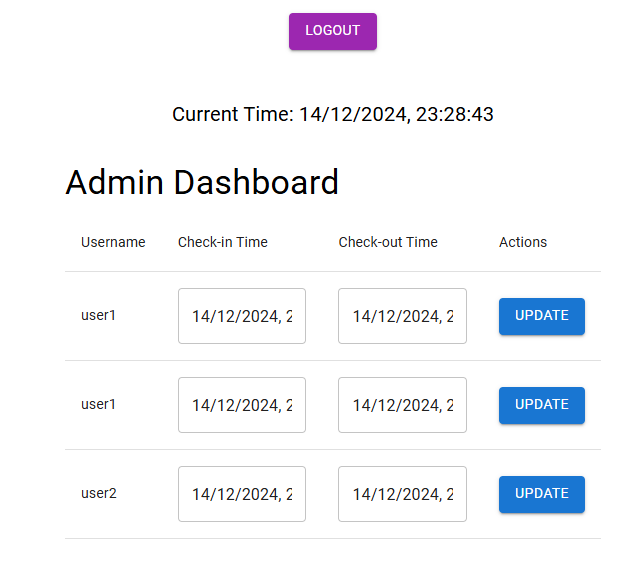
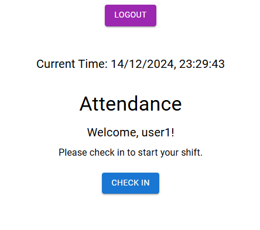
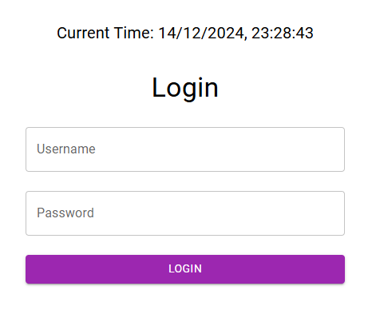

# Attendance System

This project is a full-stack attendance management system built with **React** (frontend) and **Node.js/Express** (backend). The system is designed to handle employee attendance in Germany, leveraging the WorldTimeAPI for accurate time synchronization.

## Table of Contents

- [Features](#features)
- [Installation](#installation)
- [Project Structure](#project-structure)
- [Data Models](#data-models)
- [API Endpoints](#api-endpoints)
- [Usage](#usage)
- [Example Code](#example-code)
- [Future Features](#future-features)
- [Contributing](#contributing)
- [License](#license)

## Features

1. **Time Synchronization**: Displays the current time for Germany using the [WorldTimeAPI](https://worldtimeapi.org/).
2. **Authentication**: Users log in with predefined credentials (`admin`, `user1`, `user2`).
3. **Role-Based Access**:
   - **Users**: Can check in and check out.
   - **Admins**: View and edit all attendance records.
4. **Local File Storage**: Attendance data is stored in a file (`data.json`) instead of a database.
5. **Extendable Architecture**: Built for scalability, with a clear separation of concerns and reusable components.
6. **Responsive Design**: A mobile-friendly UI implemented using Material-UI.

## Installation

### Clone the Repository

```bash
git clone https://github.com/OriVered/Attendance-System-Wobi.git
cd Attendance-System-Wobi
```

### Install Dependencies

```bash
# Install client dependencies
cd client
npm install

# Install server dependencies
cd ../server
npm install
```

### Start the Servers

```bash
# Start the backend server
cd server
npm run serve

# Start the frontend application
cd ../client
npm start
```

The client will run on `http://localhost:3000`, and the server will run on `http://localhost:5000`.

## Project Structure

### Client (React)

- `src/components`: Contains reusable React components like `ClockLayout` and `ProtectedRoute`.
- `src/pages`: Page-level components for Login, Attendance, and Admin views.
- `src/context`: Global state management using `AuthContext` and `TimeContext`.
- `src/services`: API interaction logic (e.g., fetching attendance data or time).
- `src/consts`: Constants like API routes, application routes, and text definitions.

### Server (Node.js/Express)

- `src/controllers`: Contains request handling logic for authentication and attendance.
- `src/models`: Defines the structure of `User` and `AttendanceRecord`.
- `src/routes`: API route handlers for authentication and attendance.
- `src/services`: Handles business logic for attendance and user authentication.
- `src/utils`: Utility functions (e.g., file operations).
- `src/data`: Stores `data.json` for attendance and user data.

## Data Models

### User Model

```typescript
{
  id: number;       // Unique user ID
  username: string; // Login username
  password: string; // Hashed password
  role: string;     // 'admin' or 'user'
}
```

### Attendance Record

```typescript
{
  id: string;        // Unique record ID
  userId: number;    // ID of the user
  userName: string;  // User's name
  checkIn?: string;  // Check-in timestamp
  checkOut?: string; // Check-out timestamp
  date: string;      // Date of the record
}
```

## API Endpoints

### Authentication
- `POST /api/auth/login`: Logs in a user and returns a JWT.
- `POST /api/auth/logout`: Ends the user's session.

### Attendance
- `POST /api/attendance`: Submits check-in or check-out data.
- `GET /api/attendance`: Fetches all attendance records (admin only).
- `GET /api/attendance/user`: Fetches attendance records for the logged-in user.

## Usage

### Login
- Navigate to `http://localhost:3000`.
- Use one of the following credentials:
  - Admin: `admin` / `1234`
  - User1: `user1` / `user1`
  - User2: `user2` / `user2`

### Admin Dashboard
- Access `http://localhost:3000/admin` (admin credentials required).
- View and edit attendance records.

### User Actions
- Access `http://localhost:3000/attendance` (user credentials required).
- Check in or check out using the provided buttons.


## Screenshots

### Admin Dashboard


### Attendance Page


### Login Page


## Future Features

### 1. Password Encryption
To enhance security, all user passwords will be hashed and stored securely. This will prevent sensitive data exposure in the case of unauthorized access.

### 2. Audit Logs
Introduce an audit log system to track and log all user actions (e.g., check-in, check-out, and admin modifications) for better transparency and debugging.

### 3. Database Integration
Replace local file storage (`data.json`) with a robust database like PostgreSQL or MongoDB to handle scalability and reliability.


